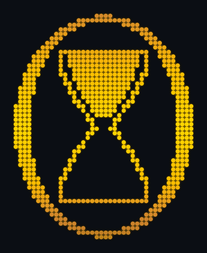

<p align="center">
  
</p>

<h1 align="center">Thetaglass</h1>

<p align="center">
  <em>An hourglass for theta decay.</em>
</p>

> A self-hosted watchdog for **sold** options. It tracks each credit spread against its
> own decay curve — computing how far along it *should* be vs. where it actually is,
> scoring position health, and surfacing it on its own clock. Robinhood gives you the
> state (Greeks, IV); Thetaglass gives you the **progress**.

> [!IMPORTANT]
> **Read-only.** Thetaglass never places, modifies, or closes orders. It only ever
> *reads* your positions and quotes. The only thing it writes is its own local database.

---

## The idea

You **sold** a credit spread. Someone paid you a *credit* up front, and your job is to
hand back as little of it as possible before expiration. Two forces run the whole time:

1. **Theta (time decay) — your friend.** The options you're short lose value as
   expiration nears, and you profit when they do. Like sand falling through an
   hourglass. That's the name.
2. **Price movement — your risk.** If the underlying drifts toward your **short
   strike**, the trade gets dangerous fast — decay or no decay.

Thetaglass answers one question on a clock: **"Is this trade melting the way I expected
when I sold it, or has something gone wrong?"** It models the decay baseline a spread
*should* follow (√time), compares it to reality, blends in your price cushion and IV
regime, and scores each position's **health** — then keeps watching while you don't.

The mark up top is the whole thesis in one glyph: a Greek **θ** with an hourglass
inscribed. The sand level is **how far the position has run through its life** — top-full
at open, draining to bottom-full by expiration. (In the live monitor it's a *static*
per-position readout, not an animation; the GIF just shows the full sweep.)

---

## Install

```bash
python3 -m venv .venv && . .venv/bin/activate
pip install -e .                 # add ',[dev]' for tests, ',[gif]' to rebuild the logo

tg auth login                    # prints a URL — approve it on your phone
tg auth complete '<code-or-url>' # paste the code (or full redirect URL) back
```

Robinhood auth is a PKCE public-client OAuth flow: approve once on your phone, and the
token auto-refreshes after that. Secrets live in `var/credentials/` (gitignored, chmod
600) — nothing sensitive is ever committed.

## Quickstart

```bash
tg sync                # one read: assemble your live spreads, write a snapshot
tg status              # Gantt timeline of every open position (open → expiration)
tg monitor             # interactive ↑/↓ drill-down: P/L cone, underlying, IV, health
tg timekeeper start    # run the sync heartbeat in the background (every 5 min, market hours)
```

No positions yet, or just want to see it? Every view takes `--mock`:

```bash
tg monitor --mock 6    # six synthetic spreads to arrow through
tg history --mock 2    # frozen "receipts" for closed positions
```

---

## Commands

| Command | What it does |
|---|---|
| `tg auth login` / `complete` / `status` | Robinhood OAuth (approve once on phone, auto-refresh). |
| `tg sync [--daily-close]` | One sync tick: read the book, recompute, append a snapshot. `--daily-close` stores the full Position JSON as the day's record. |
| `tg status` | The overview — a Gantt timeline of open positions, each bar colored by health, with a NOW marker on the decay runway. |
| `tg monitor [--mock N]` | Interactive dashboard. ↑/↓ selects a position; charts re-render: P/L cone, underlying vs. profit-edges, IV-vs-entry, and a health scoreboard with the θ-hourglass. |
| `tg history [--mock N]` | Frozen **receipts** for *closed* positions — the same drill-down depth, snapshotted as-of the moment each closed, with a CLOSED banner (outcome + final P/L). Offline (store-only). |
| `tg backfill` | Fetch real daily underlying bars (for the price line + realized vol). |
| `tg inspect` / `tg dump` | Run the live pipeline and print each canonical `Position` / dump the raw broker JSON. The plumbing-level inspection tools. |
| `tg timekeeper start` / `stop` / `restart` / `status` / `logs` | The sync heartbeat under PM2 (see below). |

## The Timekeeper

The Timekeeper (Clock 1) is the background heartbeat. While the market is open it syncs
every `TICK_SECONDS` (default 5 min) and appends history; when closed it sleeps until
the next session. All state lives in the store, so it's safe to restart anytime.

```bash
tg timekeeper start     # launch under PM2 (idempotent); needs Node + `npm i -g pm2`
tg timekeeper status    # is it online, and when did it LAST actually sync (from the store)?
tg timekeeper logs      # tail the heartbeat
```

`tg timekeeper status` is the source of truth for liveness — it reports the daemon's
process state *and* the real `last_tick_at` from the database, so a dead daemon can't
masquerade as healthy.

---

## How it works

A four-layer pipeline turns raw broker data into a health score, plus two clocks.

| Layer | Role |
|---|---|
| **A — Model** | Normalize messy per-leg broker data into one canonical `Position`. Every field is tagged by *provenance* (`FROZEN` / `CACHED` / `LIVE` / `DERIVED`) — which tells the code what to compute once vs. re-pull every tick. |
| **B — Identity** | A stable `position_id` (hash of sorted leg ids) so the same spread is recognized across ticks even as quotes move. |
| **C — Store** | SQLite (WAL): an append-only `snapshots` log (slim every tick, full JSON on daily close), a `positions` lifecycle table, `positions_current`, equity bars, and instruments. Single writer (the Timekeeper), many readers. |
| **D — Decay & health** | The baseline a spread *should* follow (√time), compared to reality, blended with price cushion and IV regime into a `health_score`. |
| **E — Views** | `tg status` (Gantt overview), `tg monitor` / `tg history` (the braille drill-down). |

### The health score

Three axes, each scored 0–1, then blended — but any axis below the critical floor caps
the whole score (a price breach can't be averaged away):

| Axis | Weight | Asks |
|---|---|---|
| **θ-track** | 40% | Is P/L where the decay curve says it should be by now? |
| **strike** | 40% | How much price cushion is left to the short strike? |
| **iv** | 20% | Has implied vol stayed stable vs. where we sold? |

The baseline is frozen at first sighting (especially `iv_at_entry`), so a later tick
whose quote has drifted can't retroactively rewrite "what we expected when we sold."

The charts are [plotille](https://github.com/tammoippen/plotille) rgb-braille; the
interactive monitor is [Textual](https://textual.textualize.io/) (it captures the arrow
keys Rich can't). See [`docs/STATE_MACHINE.md`](docs/STATE_MACHINE.md) for every formula
worked against a real QQQ spread, and [`docs/FINDINGS.md`](docs/FINDINGS.md) for the
Robinhood data shapes it's designed against.

---

## Configuration

The trading-judgment knobs live in [`src/thetaglass/settings.py`](src/thetaglass/settings.py)
— change them and the health math shifts; nothing structural does:

| Knob | Default | Meaning |
|---|---|---|
| `DECAY_EXPONENT` | `0.5` | √time decay shape (<1 ⇒ decay accelerates toward expiry). |
| `W_THETA` / `W_STRIKE` / `W_IV` | `0.4 / 0.4 / 0.2` | Health-axis blend weights. |
| `CRIT` | `0.34` | Any axis below this floors the whole score. |
| `BREACH_THRESHOLD_PCT` | `0.03` | Price cushion that still counts as "safe." |
| `IV_ALERT_THRESHOLD_PCT` | `0.15` | IV jump from entry that's alarming. |
| `CLOSE_GRACE_TICKS` | `2` | Consecutive missing ticks before a position is marked closed. |
| `TICK_SECONDS` | `300` | Heartbeat between syncs during market hours. |

`THETAGLASS_HOME` relocates all local state (for Docker / alt deployments). Everything
mutable — credentials, the DB, logs — lives under `var/` (gitignored).

## Development

```bash
pip install -e '.[dev]'
.venv/bin/python -m pytest          # the full suite

# regenerate the README logo after a geometry change:
pip install -e '.[gif]'
python tools/render_logo_gif.py
```

## Roadmap

Watching live today: the four-layer pipeline, the store, the Timekeeper, and all three
views. Next: an alert store + emitter (Telegram), a richer `terminal_outcome`
(assignment vs. expiration), an MCP server to read the book conversationally, and Docker
packaging.
